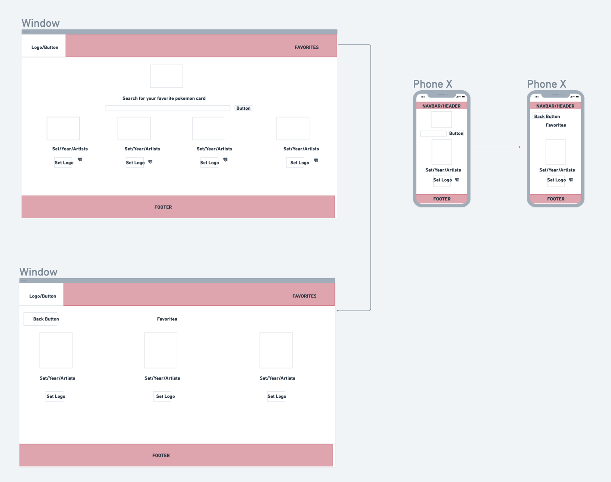
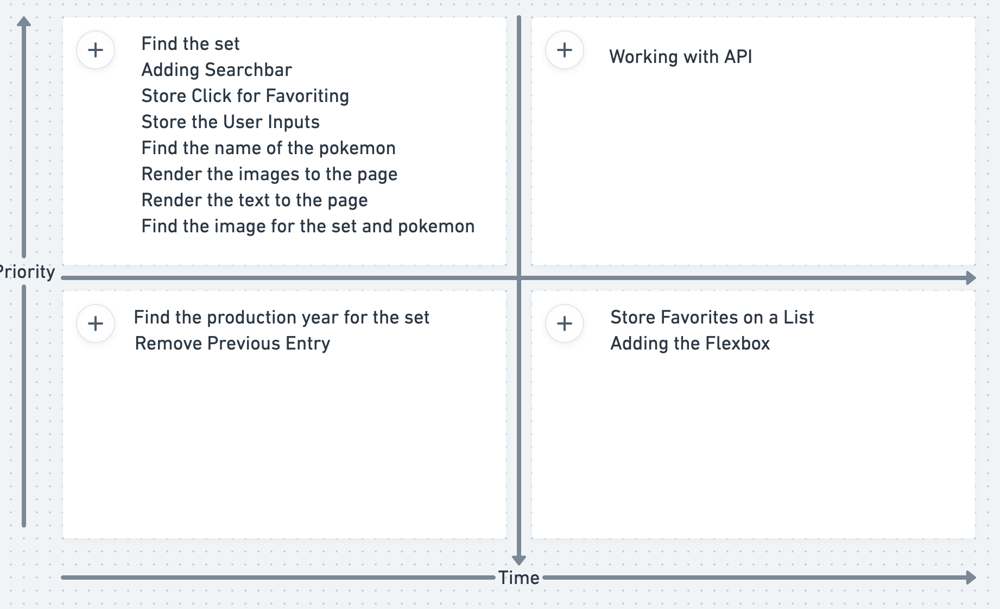

# Project Overview

## Project Name

<!-- The name of your project. -->
Pokemon TCG Lookup Database/Pokedex


## Project Description

<!-- Use this section to describe your final project and perhaps any links to relevant sites that help convey the concept and\or functionality. -->
The app will search a pokemon by name, and populate all the cards that ever released for that specific pokemon. Some of the data that will return include, the name of the pokemon(including any special "upgrades:) an image of the card, set, and year the set was produced

## API and Data Sample

<!-- Specify the API you are using and include a link. Show us a snippet of JSON returned by your API so we know you can access it and get the info you need -->

~~~
{
    "data": [
        {
            "id": "pl3-1",
            "name": "Absol G",
            "supertype": "Pokémon",
            "subtypes": [
                "Basic"
            ],
            "level": "59",
            "hp": "70",
            "types": [
                "Darkness"
            ],
            "attacks": [
                {
                    "name": "Feint Attack",
                    "cost": [
                        "Darkness"
                    ],
                    "convertedEnergyCost": 1,
                    "damage": "",
                    "text": "Choose 1 of your opponent's Pokémon. This attack does 20 damage to that Pokémon. This attack's damage isn't affected by Weakness, Resistance, Poké-Powers, Poké-Bodies, or any other effects on that Pokémon."
                },
                {
                    "name": "Doom News",
                    "cost": [
                        "Darkness",
                        "Colorless",
                        "Colorless"
                    ],
                    "convertedEnergyCost": 3,
                    "damage": "",
                    "text": "Return all Energy cards attached to Absol G to your hand. The Defending Pokémon is Knocked Out at the end of your opponent's next turn."
                }
            ],
            "weaknesses": [
                {
                    "type": "Fighting",
                    "value": "×2"
                }
            ],
            "resistances": [
                {
                    "type": "Psychic",
                    "value": "-20"
                }
            ],
            "retreatCost": [
                "Colorless"
            ],
            "convertedRetreatCost": 1,
            "set": {
                "id": "pl3",
                "name": "Supreme Victors",
                "series": "Platinum",
                "printedTotal": 147,
                "total": 150,
                "legalities": {
                    "unlimited": "Legal"
                },
                "ptcgoCode": "SV",
                "releaseDate": "2009/08/19",
                "updatedAt": "2018/03/07 22:40:00",
                "images": {
                    "symbol": "https://images.pokemontcg.io/pl3/symbol.png",
                    "logo": "https://images.pokemontcg.io/pl3/logo.png"
                }
            },
            "number": "1",
            "artist": "Yusuke Ishikawa",
            "rarity": "Rare Holo",
            "nationalPokedexNumbers": [
                359
            ],
            "legalities": {
                "unlimited": "Legal"
            },
            "images": {
                "small": "https://images.pokemontcg.io/pl3/1.png",
                "large": "https://images.pokemontcg.io/pl3/1_hires.png"
            },
            "tcgplayer": {
                "url": "https://prices.pokemontcg.io/tcgplayer/pl3-1",
                "updatedAt": "2021/11/03",
                "prices": {
                    "holofoil": {
                        "low": 4.4,
                        "mid": 5.5,
                        "high": 10.15,
                        "market": 4.91,
                        "directLow": null
                    },
                    "reverseHolofoil": {
                        "low": 2.0,
                        "mid": 2.92,
                        "high": 4.99,
                        "market": 4.28,
                        "directLow": null
                    }
                }
            },
            "cardmarket": {
                "url": "https://prices.pokemontcg.io/cardmarket/pl3-1",
                "updatedAt": "2021/11/03",
                "prices": {
                    "averageSellPrice": 3.89,
                    "lowPrice": 0.49,
                    "trendPrice": 4.0,
                    "germanProLow": null,
                    "suggestedPrice": null,
                    "reverseHoloSell": null,
                    "reverseHoloLow": 1.25,
                    "reverseHoloTrend": 3.39,
                    "lowPriceExPlus": 2.19,
                    "avg1": 4.9,
                    "avg7": 3.63,
                    "avg30": 3.3,
                    "reverseHoloAvg1": 5.0,
                    "reverseHoloAvg7": 2.49,
                    "reverseHoloAvg30": 2.33
                }
            }
       },
~~~

## Wireframes

<!-- Upload images of your wireframes to an image hosting site or add them to an assets folder in your repo and link them here with a description of each specific wireframe. -->


### MVP/PostMVP

<!-- The functionality will then be divided into two separate lists: MVP and PostMVP.  Carefully decided what is placed into your MVP as the client will expect this functionality to be implemented upon project completion.   -->

#### MVP 
<!-- *These are examples only. Replace with your own MVP features.*

- Find and use external api 
- Render data on page 
- Allow user to choose favorites  -->
- Find and use external api
- Render name, set, production year, and images on page
- Allow user to favorite selections

#### PostMVP  
<!-- *These are examples only. Replace with your own Post-MVP features.*

- Add second API
- Use local storage to save user favorites -->
- Allow users to filter by sets and years
- Dark mode and light mode button

## Project Schedule

<!-- This schedule will be used to keep track of your progress throughout the week and align with our expectations.   -->
<!-- 
You are **responsible** for scheduling time with your squad to seek approval for each deliverable by the end of the corresponding day, excluding `Saturday` and `Sunday`.

|  Day | Deliverable | Status
|---|---| ---|
|July 10-12| Prompt / Wireframes / Priority Matrix / Timeframes | Incomplete
|July 13| Project Approval | Incomplete
|July 13| Core Application Structure (HTML, CSS, etc.) | Incomplete
|July 14| Pseudocode / actual code | Incomplete
|July 15| Initial Clickable Model  | Incomplete
|July 16| MVP | Incomplete
|July 17| Presentations | Incomplete -->

|  Day | Deliverable | Status
|---|---| ---|
|Nov 6-8| Prompt / Wireframes / Priority Matrix / Timeframes | Incomplete
|Nov 9| Project Approval | Incomplete
|Nov 10| Core Application Structure (HTML, CSS, etc.) | Incomplete
|Nov 11| Adding the API | Getting all the Information From API | Rending all of the information and images | Incomplete
|Nov 12| Adding the favorting function | Incomplete
|Nov 13| MVP | Incomplete
|Nov 14| Presentations | Incomplete -->

## Priority Matrix

<!-- Include a full list of features that have been prioritized based on the `Time and Importance` Matrix.  Link this image in a similar manner to your wireframes -->



## Timeframes

<!-- Tell us how long you anticipate spending on each area of development. Be sure to consider how many hours a day you plan to be coding and how many days you have available until presentation day.

Time frames are also key in the development cycle.  You have limited time to code all phases of the game.  Your estimates can then be used to evalute game possibilities based on time needed and the actual time you have before game must be submitted. It's always best to pad the time by a few hours so that you account for the unknown so add and additional hour or two to each component to play it safe. Throughout your project, keep track of your Time Invested and Actual Time and update your README regularly.

| Component | Priority | Estimated Time | Time Invested | Actual Time |
| --- | :---: |  :---: | :---: | :---: |
| Adding Form | H | 3hrs| 3.5hrs | 3.5hrs |
| Working with API | H | 3hrs| 2.5hrs | 2.5hrs |
| Total | H | 6hrs| 5hrs | 5hrs | -->

| Component | Priority | Estimated Time | Time Invested | Actual Time |
| --- | :---: |  :---: | :---: | :---: |
| Adding Searchbar | H | 3hrs| 3hrs | hrs |
| Working with API | H | 3hrs| 3hrs | hrs |
| Store the User Inputs  | H | 3hrs| 3hrs | hrs |
| Find the name of the pokemon | H | 3hrs| 3hrs | hrs |
| Find the set | H | 3hrs| 3hrs | hrs |
| Find the production year for the set | H | 3hrs| 3hrs | hrs |
| Render the text to the page | H | 3hrs| 3hrs | hrs |
| Find the image for the set and pokemon | H | 3hrs| 3hrs | hrs |
| Render the images to the page | H | 3hrs| 3hrs | hrs |
| Remove Previous Entry | L | 3hrs| 3hrs | hrs |
| Store Click for Favoriting | H | 3hrs| 3hrs | hrs |
| Store Favorites on a List | L | 3hrs| 3hrs | hrs |
| Adding the Flexbox | L | 3hrs| 3hrs | hrs |
| Total | H | 39hrs| 39hrs | hrs | -->

## Code Snippet

<!-- Use this section to include a brief code snippet of functionality that you are proud of and a brief description.  

```
function reverse(string) {
	// here is the code to reverse a string of text
}
``` -->

## Change Log
 <!-- Use this section to document what changes were made and the reasoning behind those changes.   -->